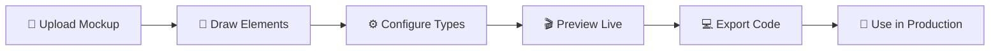

# ⚡ Skeleton Loader Generator

> Transform your UI mockups into production-ready skeleton loaders in seconds. No coding required!

## 🎯 What is this?

Ever spent hours creating skeleton loaders manually? **Never again!** 

This tool lets you upload any UI mockup and visually create skeleton loaders by simply drawing rectangles. Get production-ready React + Tailwind or pure CSS code instantly.

## ✨ Features

🎨 **Visual Editor** - Draw skeleton elements directly on your mockup  
⚡ **Instant Code** - Generate React or CSS code in real-time  
🎯 **Pixel Perfect** - Drag, resize, and position with precision  
🎬 **Live Preview** - See animated skeleton loader as you build  
🚀 **Production Ready** - Clean, responsive, optimized code  
🎨 **Color Customization** - Multiple skeleton color options  
↩️ **Undo/Redo** - Full history tracking  
📱 **Responsive** - Works on desktop, tablet, and mobile  

## 🚀 Try It Now

**[🎬 Live Demo](https://skeleton-loader-generator-ashwani.vercel.app/)**

## 🛠️ How It Works



### 1. Upload Your Mockup
Drop any PNG, JPG, or GIF of your UI design

### 2. Draw Elements  
Click and drag to mark text blocks, images, buttons, avatars

### 3. Customize
- Drag to reposition
- Resize via corner handles  
- Choose element types
- Pick skeleton colors

### 4. Export
Copy clean React + Tailwind or pure CSS code

## 💻 Tech Stack

- **Frontend**: Next 15, Tailwind CSS
- **Canvas**: HTML5 Canvas API
- **Icons**: Lucide React
- **Deployment**: Vercel

## 🚀 Quick Start

```bash
# Clone the repository
git clone https://github.com/ashwani3011/skeleton-loader-generator

# Navigate to project
cd skeleton-loader-generator

# Install dependencies
npm install

# Start development server
npm run dev

# Build for production
npm run build
```

## 🎨 Example Generated Code

### React + Tailwind
```jsx
import React from 'react';

const SkeletonLoader = () => {
  return (
    <div className="relative w-full animate-pulse" style={{ paddingBottom: '56.25%' }}>
      <div className="absolute bg-gray-200 rounded" style={{
        left: '5%', top: '10%', width: '60%', height: '8%'
      }} />
      <div className="absolute bg-gray-200 rounded-full" style={{
        left: '5%', top: '25%', width: '15%', height: '20%'
      }} />
    </div>
  );
};

export default SkeletonLoader;
```

### Pure CSS
```css
.skeleton-container {
  position: relative;
  width: 100%;
  padding-bottom: 56.25%;
}

.skeleton-item {
  position: absolute;
  background: #e5e7eb;
  animation: pulse 2s cubic-bezier(0.4, 0, 0.6, 1) infinite;
}

@keyframes pulse {
  0%, 100% { opacity: 1; }
  50% { opacity: .5; }
}
```

## 🎯 Use Cases

### E-commerce
- Product cards
- Shopping cart items  
- User profiles

### Social Media
- Post skeletons
- Comment threads
- User feeds

### Dashboard
- Analytics cards
- Data tables
- Navigation menus

### Mobile Apps
- List items
- Profile screens
- Content feeds

## 🤝 Contributing

We love contributions! Here's how you can help:

### 🐛 Found a Bug?
[Open an issue](https://github.com/ashwani3011/skeleton-loader-generator/issues) with:
- Steps to reproduce
- Expected vs actual behavior
- Screenshots if applicable

### 💡 Have an Idea?
[Start a discussion](https://github.com/ashwani3011/skeleton-loader-generator/discussions) about:
- New features
- Improvements
- Use cases

### 🛠️ Want to Code?
1. Fork the repository
2. Create a feature branch (`git checkout -b feature/amazing-feature`)
3. Commit your changes (`git commit -m 'Add amazing feature'`)
4. Push to the branch (`git push origin feature/amazing-feature`)
5. Open a Pull Request

## 🌟 Why This Tool Exists

As developers, we've all been there:
- ⏰ Spending hours manually creating skeleton loaders
- 🎯 Guessing pixel positions and dimensions
- 🔄 Copy-pasting and tweaking CSS values
- 😫 Maintaining skeleton code alongside component updates

**This tool solves all of that.** Visual creation, instant code, perfect results.

## 📊 Stats

- ⚡ **2 minutes** average creation time
- 🎯 **100%** visual accuracy
- 💻 **0** manual CSS required
- 🚀 **Production-ready** code output


## 💬 Community

- **GitHub Discussions**: [Ask questions & share ideas](https://github.com/ashwani3011/skeleton-loader-generator/discussions)
- **LinkedIn**: [Connect with me](https://www.linkedin.com/in/ashwani3011/)

## ❤️ Support

If this tool saved you time, consider:

- ⭐ **Starring** the repository
- 🐦 **Sharing** on social media
- 💬 **Spreading** the word to fellow developers

---

Made with ❤️ by [Ashwani Kumar Jha](https://www.linkedin.com/in/ashwani3011/)